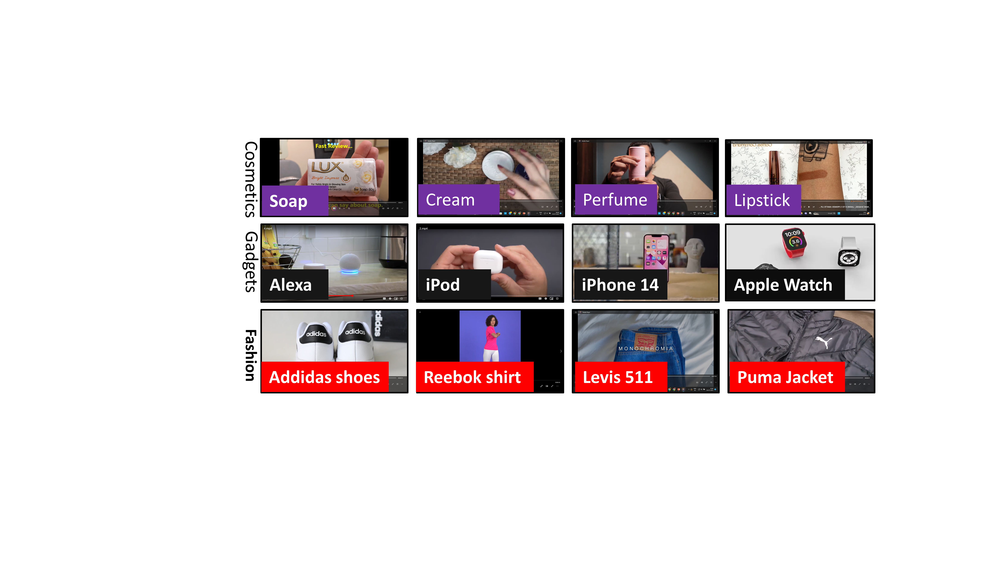

### Publication
1. Pal, Ratnabali, Samarjit Kar, and Arif Ahmed Sekh. "Enhancing Accessibility in Online Shopping: A Dataset and Summarization Method for Visually Impaired Individuals." SN Computer Science 5, no. 8 (2024): 1010 
2. Pal, Ratnabali, Samarjit Kar, and Arif Ahmed Sekh. "Artificial eye: online video browsing guide for visually impaired." International Conference on Computer Vision and Image Processing. Cham: Springer Nature Switzerland, 2023 
[Link to The Paper]( 1. https://doi.org/10.1007/s42979-024-03351-w 2. https://doi.org/10.1007/978-3-031-58174-8_35 )

### Abstract
Vision is essential for learning about the world around us. However, missing one's vision makes it challenging to lead a regular, everyday life. Either because of a lack of awareness or understanding or because of financial limitations, many visually impaired people may not have access to technology that could enable them to become independent. Our innovative research acts as a true companion, helping visually impaired (VI) people achieve online shopping independence in 2 major areas- category-specific Video Summarization and Visual Question-Answering (VQA). In this article, we propose a new dataset, namely PRVDVI (Product Review Video Dataset for the visually impaired). This dataset includes product review videos downloaded from YouTube for a variety of things, including everyday consumer goods, fashionable clothing, and technical gadgets. First, we used Whisper, a general-purpose speech recognition model developed by OpenAI to extract the text from the audio. Next, we employ a novel topic-guided summarization technique that allows VI people to navigate through the enormous video content of a product. We also keep a space for visual question answering in such large-volume videos. We make this dataset available to inspire the computer vision research community to develop more versatile algorithms that can help low-vision people

### License

Copyright © 2025 Ratnabali Pal

The content of this repository is bound by the following licenses:

- The documents and data are licensed under the MIT license.
